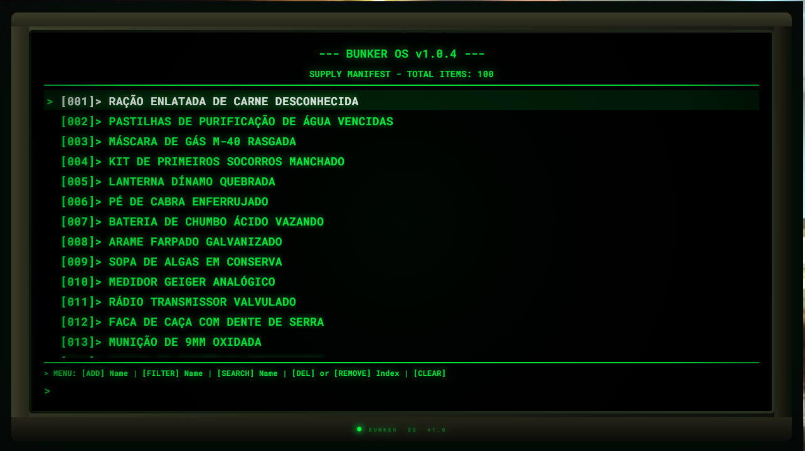

# UNIVERSIDADE FEDERAL RURAL DO SEMI-ÁRIDO – UFERSA
## PROGRAMA DE PÓS-GRADUAÇÃO EM CIÊNCIA DA COMPUTAÇÃO – PPgCC

---

&nbsp;

&nbsp;

&nbsp;

&nbsp;

# BUNKER OS: IMPLEMENTAÇÃO DE SISTEMA DE INVENTÁRIO PÓS-APOCALÍPTICO COM LISTA SIMPLESMENTE ENCADEADA

&nbsp;

&nbsp;

**Aluno:** José Cláudio Medeiros de Lima

**Professor:** Raul Benites

&nbsp;

&nbsp;

&nbsp;

&nbsp;

**Mossoró – RN, 2026**

---

&nbsp;

---

## 1. INTRODUÇÃO

O presente trabalho descreve o desenvolvimento de um sistema de gerenciamento de inventário implementado como parte do Desafio Lista Linear, proposto na disciplina de Estruturas de Dados do Programa de Pós-Graduação em Ciência da Computação da UFERSA. A atividade propõe a implementação de um jogo de gestão de inventário capaz de adicionar, remover, buscar e listar itens, utilizando uma estrutura de lista linear e lendo os dados a partir de um arquivo `.txt` contendo exatamente 100 itens.

Para além dos requisitos técnicos, o trabalho adota uma proposta estética e narrativa particular: o sistema é apresentado como o terminal de um antigo computador instalado em um bunker de sobrevivência em um mundo pós-apocalíptico. O software, denominado **BUNKER OS**, simula a aparência e o comportamento de um programa de linha de comando rodando em hardware dos anos 1980–1990, com fontes monoespaçadas, paleta de cores verde-fósforo sobre fundo preto, efeitos visuais de tela CRT com scanlines e curvatura, e moldura de monitor antigo com acabamento em plástico bege envelhecido.

A temática do inventário segue a mesma lógica do cenário: os 100 itens do arquivo são objetos que um sobrevivente poderia encontrar em um bunker ou no mundo devastado — rações enlatadas, máscaras de gás, baterias corroídas, morfina em ampola, medidores Geiger, munições oxidadas, e outros artefatos de um mundo que não existe mais.

**Prompt utilizado para gerar a lista de itens (ChatGPT – GPT-4o / OpenAI):**

> *"Gere uma lista de exatamente 100 itens de sobrevivência para um abrigo subterrâneo pós-apocalipse nuclear. Inclua suprimentos médicos, ferramentas enferrujadas, alimentos em conserva bizarros, componentes eletrônicos sucateados e itens de defesa. Formate a lista com um item por linha, apenas o nome do item."*

O sistema foi implementado na linguagem **Dart** utilizando o framework **Flutter**, com execução na plataforma Windows. A estrutura de dados central é uma **lista simplesmente encadeada** implementada manualmente, sem uso de coleções nativas do Dart, atendendo ao requisito de implementação explícita de uma das estruturas estudadas.

> **Código-fonte completo:** O repositório do projeto está disponível em **https://github.com/claudiomedeiros82/inventory**. Neste documento são apresentados apenas os arquivos diretamente relacionados ao escopo do trabalho. Um aplicativo Flutter gera automaticamente dezenas de arquivos de suporte — gerenciadores de plataforma, plugins, scripts de build, geração de código, manifests de assets, etc. — que não compõem a lógica implementada e foram omitidos para objetividade.

---

## 2. DESENVOLVIMENTO

### 2.1 Arquitetura e Tecnologias

O projeto foi desenvolvido em Flutter/Dart para desktop Windows, com uma arquitetura em camadas:

- **Camada de Domínio** (`lib/core/domain/`): contém as entidades `ItemEntity` e `Node`, bem como a implementação da `CustomLinkedList`.
- **Camada de Serviço** (`lib/services/`): contém o `InventoryService`, responsável pelas operações sobre a lista e pela persistência em arquivo.
- **Camada de UI** (`lib/ui/`): contém o `InventoryController` (padrão ChangeNotifier/Provider) e todos os widgets visuais.

A interface é composta por widgets que reconstituem a experiência de um terminal antigo: moldura de gabinete CRT (`BezelFrame`), efeito de tela catódica com scanlines (`CRTScreen`), cabeçalho com status (`TerminalHeader`), lista rolável (`InventoryListView`), barra de menu e campo de prompt.

### 2.2 Estrutura de Dados: Lista Simplesmente Encadeada

A estrutura de dados central é uma **lista simplesmente encadeada** implementada nos arquivos `lib/core/domain/node.dart` e `lib/core/domain/custom_linked_list.dart`. A escolha é intencional: a lista encadeada é a estrutura mais adequada para um inventário cujo tamanho varia dinamicamente, permitindo inserção e remoção sem realocação de memória.

#### 2.2.1 Entidade de Item (`ItemEntity`)

A entidade `ItemEntity` é o dado carregado em cada nó da lista. Ela representa um item do inventário com seu nome:

```dart
// lib/core/domain/item_entity.dart
class ItemEntity {
  final String nome;

  const ItemEntity({required this.nome});

  @override
  String toString() => 'ItemEntity(nome: $nome)';
}
```

#### 2.2.2 Nó da Lista (`Node`)

O nó encapsula um `ItemEntity` e mantém um ponteiro para o próximo nó da cadeia. O atributo `next` é nulável (`Node?`), indicando o fim da lista quando `null`:

```dart
// lib/core/domain/node.dart
import 'item_entity.dart';

class Node {
  final ItemEntity item;
  Node? next;

  Node(this.item);
}
```

#### 2.2.3 Lista Encadeada (`CustomLinkedList`)

A `CustomLinkedList` mantém a referência para o nó cabeça (`_head`) e o tamanho atual (`_size`). Todas as quatro operações do desafio são implementadas nesta classe:

```dart
// lib/core/domain/custom_linked_list.dart
import 'package:diacritic/diacritic.dart';
import 'item_entity.dart';
import 'node.dart';

class CustomLinkedList {
  Node? _head;
  int _size = 0;

  Node? get head => _head;
  int get size => _size;

  // ADICIONAR: percorre até o último nó e insere ao final — O(n)
  void add(ItemEntity item) {
    final newNode = Node(item);
    if (_head == null) {
      _head = newNode;
    } else {
      Node? current = _head;
      while (current?.next != null) {
        current = current?.next;
      }
      current?.next = newNode;
    }
    _size++;
  }

  // REMOVER: localiza pelo nome e reconecta os ponteiros — O(n)
  bool remove(String nome) {
    if (_head == null) return false;

    final target = removeDiacritics(nome.trim().toLowerCase());

    if (removeDiacritics(_head!.item.nome.trim().toLowerCase()) == target) {
      _head = _head?.next;
      _size--;
      return true;
    }

    Node? current = _head;
    while (current?.next != null) {
      if (removeDiacritics(current!.next!.item.nome.trim().toLowerCase()) == target) {
        current.next = current.next!.next;
        _size--;
        return true;
      }
      current = current.next;
    }

    return false;
  }

  // BUSCAR: retorna o índice 0-based do primeiro nó que contém a substring — O(n)
  int search(String nome) {
    Node? current = _head;
    int index = 0;
    final target = removeDiacritics(nome.trim().toLowerCase());

    while (current != null) {
      final itemName = removeDiacritics(current.item.nome.trim().toLowerCase());
      if (itemName.contains(target)) {
        return index;
      }
      current = current.next;
      index++;
    }
    return -1;
  }

  // LIMPAR: desfaz a cadeia em O(1), sem percorrer os nós
  void clear() {
    _head = null;
    _size = 0;
  }

  // LISTAR: percorre a cadeia e retorna uma List<ItemEntity> — O(n)
  List<ItemEntity> toList() {
    final list = <ItemEntity>[];
    Node? current = _head;
    while (current != null) {
      list.add(current.item);
      current = current.next;
    }
    return list;
  }
}
```

A tabela a seguir resume as operações e suas complexidades:

| Operação | Método | Complexidade | Descrição |
|---|---|---|---|
| Listar | `toList()` | O(n) | Percorre todos os nós e retorna lista |
| Adicionar | `add(item)` | O(n) | Percorre até o último nó e anexa |
| Remover | `remove(nome)` | O(n) | Busca e reconecta ponteiros |
| Buscar | `search(nome)` | O(n) | Retorna índice do primeiro nó encontrado |
| Limpar | `clear()` | O(1) | Anula a cabeça |

A busca e remoção normalizam acentos via `removeDiacritics`, tornando as operações insensíveis a diacríticos (e.g., "mercurio" localiza "Mercúrio").

### 2.3 Serviço de Inventário (`InventoryService`)

O `InventoryService` é a camada que conecta a estrutura de dados à camada de apresentação e ao repositório de arquivo. Ele instancia a `CustomLinkedList`, delega as operações a ela e persiste as alterações:

```dart
// lib/services/inventory_service.dart
import '../core/domain/custom_linked_list.dart';
import '../core/domain/item_entity.dart';
import '../core/repositories/file_interface.dart';

class InventoryService {
  final IFileRepository _repository;
  final CustomLinkedList _list = CustomLinkedList();

  CustomLinkedList get list => _list;

  InventoryService(this._repository);

  // LISTAR: retorna todos os nós como lista
  List<ItemEntity> getItems() => _list.toList();

  // CARREGAR DO ARQUIVO: lê o .txt e popula a lista encadeada
  Future<void> loadInventory() async {
    _list.clear();
    final lines = await _repository.readLines();
    for (final line in lines) {
      if (line.trim().isNotEmpty) {
        _list.add(ItemEntity(nome: line.trim()));
      }
    }
  }

  // ADICIONAR: insere na lista e persiste
  Future<void> addItem(String nome) async {
    if (nome.trim().isNotEmpty) {
      _list.add(ItemEntity(nome: nome.trim()));
      await _save();
    }
  }

  // REMOVER: remove da lista e persiste; retorna false se não encontrado
  Future<bool> removeItem(String nome) async {
    final removed = _list.remove(nome);
    if (removed) {
      await _save();
    }
    return removed;
  }

  // BUSCAR: delega à lista encadeada; retorna índice 0-based ou -1
  int searchItem(String nome) => _list.search(nome);

  // Persiste o estado atual da lista no arquivo .txt
  Future<void> _save() async {
    final items = _list.toList();
    final lines = items.map((e) => e.nome).toList();
    await _repository.writeLines(lines);
  }
}
```

### 2.4 Tela Inicial — Listagem do Inventário

Ao iniciar, o sistema lê o arquivo `items.txt` e carrega os 100 itens na lista encadeada, exibindo-os em ordem na tela principal.



*Figura 1 – Tela inicial do BUNKER OS. O cabeçalho exibe o nome do sistema (`--- BUNKER OS v1.0.4 ---`) e o total de itens carregados (`SUPPLY MANIFEST – TOTAL ITEMS: 100`). A lista percorre todos os nós da estrutura encadeada via `toList()`, numerando-os sequencialmente entre colchetes. O primeiro item aparece selecionado por padrão (`>`). Na parte inferior, a barra de menu exibe os comandos disponíveis.*

A tela é dividida em três regiões funcionais: o cabeçalho com nome e status; a área de listagem rolável com os nós da cadeia; e a barra de menu com o prompt de entrada.

### 2.5 Comando `add` — Adição de Itens

O comando `add <nome>` cria um novo `ItemEntity`, instancia um `Node` e o insere ao final da lista encadeada via o método `add()` da `CustomLinkedList`. Em seguida, o arquivo `.txt` é regravado com o novo estado da lista.

**Sintaxe:** `add <nome do item>`  
**Exemplo:** `add Sabão Crá Crá`


*Figura 2 – O operador digita `add sabão crá crá` no prompt. A lista exibe os itens 089 a 100. O cabeçalho já indica "TOTAL ITEMS: 101" após a inserção do nó ao final da cadeia.*


*Figura 3 – Após a execução do `add`, o sistema navega automaticamente até o novo item e o seleciona (`>`), confirmando ao operador que o nó foi inserido no final da lista encadeada. O item `[101]> SABÃO CRÁ CRÁ` aparece como último elemento da cadeia.*

O método `add` percorre todos os nós da cadeia até o nó com `next == null` e conecta o novo nó a esse ponteiro, preservando a sequência da lista.

### 2.6 Comando `search` — Busca por Nome

O comando `search <texto>` aciona o método `search()` da `CustomLinkedList`, que percorre a cadeia do nó cabeça até o último nó, comparando cada `item.nome` (normalizado) com a substring buscada. Ao localizar o primeiro nó correspondente:

1. O cabeçalho exibe `> ITEM #NNN LOCALIZADO: "nome do item"`.
2. O item é selecionado visualmente na lista (`>`).
3. A lista rola automaticamente até o item encontrado.

**Sintaxe:** `search <nome ou trecho do nome>`  
**Exemplo:** `search mercurio`


*Figura 4 – O comando `search mercurio` localizou o item "Termômetro de Mercúrio Clínico" no índice #94 da lista encadeada. O cabeçalho exibe `> ITEM #94 LOCALIZADO: "Termômetro de Mercúrio Clínico"`. A lista rolou até o nó correspondente, que aparece selecionado com `>` ao lado de `[094]>`. A normalização de diacríticos permitiu localizar "Mercúrio" com a busca "mercurio", sem acento.*

O índice exibido ao operador é base 1 (posição humana). Internamente, `search()` retorna o índice 0-based, e o `InventoryController` soma 1 ao exibir a mensagem de status.

### 2.7 Comando `remove` — Remoção de Itens

O comando `remove <índice>` (ou `del <índice>`) identifica o item pela posição informada, exibe uma caixa de confirmação em estilo ASCII e, após confirmação, executa o método `remove()` da `CustomLinkedList`. Este método percorre a cadeia e reconecta os ponteiros, excluindo o nó da estrutura.

**Sintaxe:** `remove <número do índice>`  
**Exemplo:** `remove 015`


*Figura 5 – O operador digita `remove 015` no prompt. A tela exibe o estado pós-busca (item #94 selecionado, mensagem no cabeçalho). Ao confirmar na caixa de diálogo, o método `remove()` localiza o 15º nó da cadeia ("Bandagens de Linho Sujas"), redireciona o ponteiro `next` do nó anterior para o nó seguinte, descartando a referência ao nó removido, e regrava o arquivo.*

A operação de remoção para o nó cabeça é tratada como caso especial: `_head` passa a apontar para `_head.next`. Para os demais nós, o algoritmo percorre a cadeia até que `current.next` seja o nó alvo, então executa `current.next = current.next.next`.

### 2.8 Comando `filter` — Filtragem em Tempo Real

O comando `filter <texto>` aplica um **filtro visual** na camada de apresentação: o `InventoryController` filtra a saída de `toList()` sem modificar a lista encadeada subjacente. Apenas os itens que contêm o texto são exibidos. O comando `clear` restaura a exibição completa.

**Sintaxe:** `filter <texto>`

### 2.9 Persistência de Dados

O inventário é carregado do `items.txt` na inicialização via `loadInventory()`, que limpa a lista e percorre as linhas do arquivo inserindo cada uma como um nó. Toda operação de escrita (`add` e `remove`) chama `_save()`, que executa `toList()` e regrava o arquivo com o estado atual da cadeia — garantindo que o inventário sobreviva ao encerramento do terminal.

---

## 3. ARQUIVO DE DADOS — `items.txt`

O arquivo utilizado no sistema contém exatamente 100 itens, um por linha, gerados conforme o prompt descrito na introdução. O conteúdo é o seguinte:

```
Ração Enlatada de Carne Desconhecida
Pastilhas de Purificação de Água Vencidas
Máscara de Gás M-40 Rasgada
Kit de Primeiros Socorros Manchado
Lanterna Dínamo Quebrada
Pé de Cabra Enferrujado
Bateria de Chumbo Ácido Vazando
Arame Farpado Galvanizado
Sopa de Algas em Conserva
Medidor Geiger Analógico
Rádio Transmissor Valvulado
Faca de Caça com Dente de Serra
Munição de 9mm Oxidada
Geleia de Cogumelos Radioativos
Bandagens de Linho Sujas
Alicate de Corte de Alta Precisão
Chip de Processamento Queimado
Barra de Cereais de Grilos
Cantil de Alumínio Amassado
Cabo de Cobre Desencapado
Antibióticos de Amplo Espectro
Machado de Incêndio com Cabo Rachado
Óculos de Visão Noturna sem Lente
Carne de Rato Desidratada
Fósforos de Segurança Impermeáveis
Placa de Circuito Impresso Verde
Bastão Eletrificado com Mau Contato
Estojo de Sutura Cirúrgica
Seringa de Adrenalina Reutilizável
Ovos de Tartaruga em Salmoura
Chave de Fenda Estrela Desgastada
Filtro de Ar de Hepa Saturado
Cartuchos de Espingarda Calibre 12
Leite em Pó Amarelado
Bússola Magnética Desorientada
Fusíveis de Vidro de 10A
Spray de Pimenta Expirado
Pomada para Queimaduras de Radiação
Martelo de Unha Sem Cabeça
Válvula Termiônica de Rádio
Gordura Animal em Pote de Vidro
Lona Plástica de Polietileno
Sensores de Movimento Defeituosos
Punhal de Combate de Carbono
Solução Salina para Irrigação
Serra de Arco para Metal
Transformador de Tensão Pequeno
Língua de Boi Enlatada
Pilha Alcalina de 9V Corroída
Fio de Nylon de Alta Resistência
Morfina em Ampola de Vidro
Marreta de Construção Pesada
Teclado Mecânico sem Teclas
Polpa de Fruta Sintética
Máscara Cirúrgica Descartável
Resistores de Carbono Diversos
Granada de Atordoamento Inerte
Bolsa de Sangue Tipo O Negativo
Torquês de Armador Enferrujada
Microfone de Lapela Quebrado
Ensopado de Vísceras em Lata
Fita Isolante de Tecido
Capacitores Eletrolíticos Estufados
Funda de Couro para Pedras
Desinfetante Hospitalar Concentrado
Chave Inglesa com Trava Presa
Monitor de Tubo CRT Trincado
Refeição Pronta MRE Sabor Insetos
Sabão de Cinzas Caseiro
Indutores de Núcleo de Ferrite
Bestas de Madeira e Metal
Luvas de Procedimento Nitrílicas
Escada de Corda de Nylon
Webcam de Segurança Analógica
Cérebro de Porco em Conserva
Vela de Cera de Abelha
Placa de Vídeo de 256MB Antiga
Soco Inglês de Latão
Antisséptico de Iodo Povidona
Pá de Trincheira Dobrável
Fonte de Alimentação ATX 400W
Bisunari de Mel Melado
Agulhas Hipodérmicas Estéreis
Cabo de Aço Inoxidável
Mouse de Bolinha Desconfigurado
Mina Terrestre de Treinamento
Atadura Gessada Seca
Nível de Bolha de Alumínio
HD Externo de 500GB Batendo
Caldo de Ossos Concentrado
Papel Higiênico de Fibra Reciclada
Transistores de Potência TO-3
Escudo de Choque de Policarbonato
Termômetro de Mercúrio Clínico
Chave Allen de Milímetros
Cooler de Processador de Cobre
Fígado de Bacalhau em Óleo
Detergente Biodegradável Seco
Potenciômetros Deslizantes Ruins
Bastão Retrátil de Metal
```

---

## 4. CONCLUSÃO

O BUNKER OS atende integralmente aos requisitos do Desafio Lista Linear: realiza leitura de arquivo `.txt` com 100 itens, armazena-os em uma lista simplesmente encadeada implementada manualmente, e oferece as quatro operações exigidas — listar, adicionar, remover e buscar — por meio de uma interface de linha de comando modularizada. A separação em `Node`, `CustomLinkedList`, `InventoryService` e `InventoryController` reflete a modularização requerida, com cada componente responsável por uma única responsabilidade.

A implementação da lista encadeada expõe com clareza o funcionamento da estrutura: inserção ao final por travessia de ponteiros, remoção por reconexão de `next`, busca linear com normalização de acentos, e conversão para lista nativa apenas quando necessário para a camada de apresentação. A escolha da estrutura é adequada ao domínio: o inventário cresce e diminui dinamicamente, e a lista encadeada acomoda essas operações sem realocação de memória.

---

*José Cláudio Medeiros de Lima — PPgCC/UFERSA — Abril de 2026*
